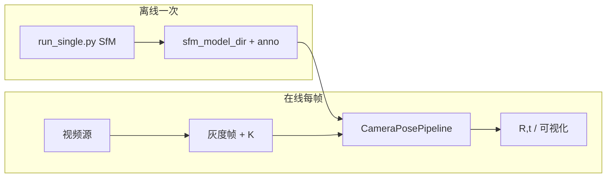
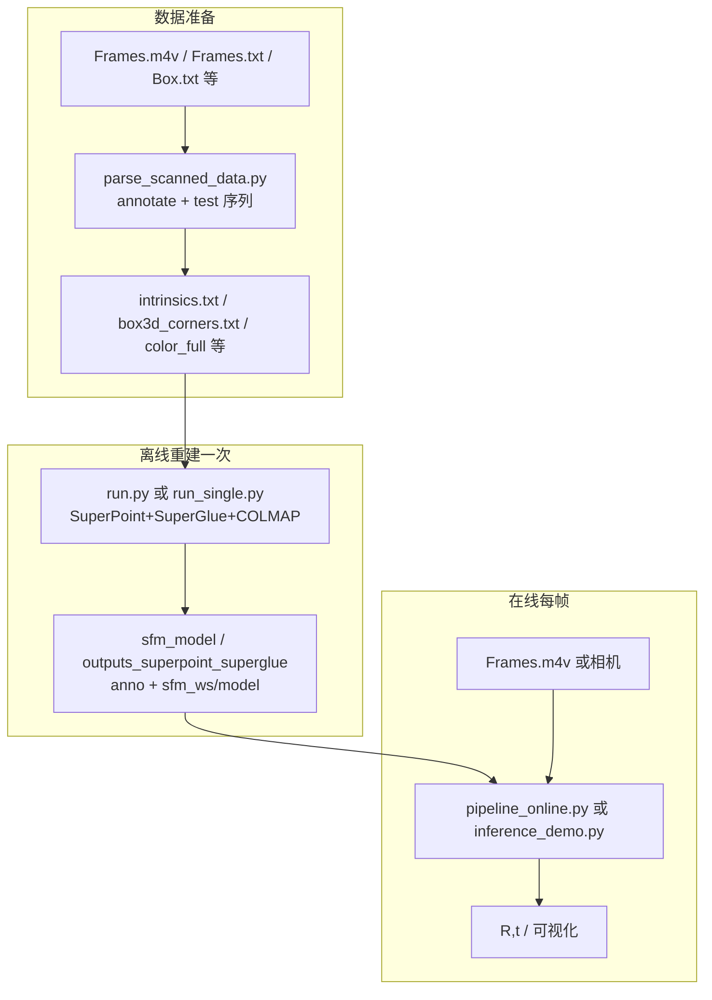

# 相机视频流 Pose Estimation 设计文档

本文档基于对 `run_single.py` 与 `test_onnx/onnx_demo/pipeline_single.py` 的代码审阅，说明如何将 OnePose 从**离线图像序列**扩展到**相机视频流**输入，并给出可实现的 API 设计与测试用例。

---

## 1. 现有代码职责划分

### 1.1 `run_single.py`（SfM 离线重建）

| 能力 | 说明 |
|------|------|
| 输入 | 数据集目录下的 `color/*.png` 列表，经 `down_ratio` 抽样 |
| 后端 | `onnx` / `torch_cpu` / `auto`：SuperPoint + SuperGlue 特征与匹配 |
| 输出 | COLMAP 三角化、`sfm_ws/model`、经 3D 包围盒过滤后的 `anno`（`anno_3d_*.npz` 等） |
| 与在线推理关系 | **不直接做逐帧位姿**；为 `pipeline_single.py` 提供必须先完成的**物体模型与标注** |

**结论**：视频流 pose estimation **依赖** `run_single.py`（或等价 `run.py` SfM 流程）事先产出的 `sfm_model_dir`，运行时不再重复跑 SfM。

### 1.2 `pipeline_single.py`（ONNX 推理流水线）

| 组件 | 作用 |
|------|------|
| `SuperPointOnnx` | 灰度图 → 2D 关键点与描述子 |
| `SuperGlueOnnx` | 参考帧与查询帧 2D–2D 匹配（检测器用） |
| `GATsSPGOnnx` | 2D–3D 匹配（主推理） |
| `LocalFeatureObjectDetectorOnnx` | 用 SfM 参考视图建立 DB，对当前帧做匹配 + RANSAC 仿射 → 裁剪 ROI |
| `OnnxOnePosePipeline.run_sequence` | 读 `color_full/*.png` 序列，逐帧：检测 → 裁剪 → 特征 → 3D 匹配 → `ransac_PnP` |

**与视频流的差距**：

- `run_sequence` 强依赖**磁盘路径**（`cv2.imread`、`img_path` 传入 `detector.detect` / `previous_pose_detect`）。
- `LocalFeatureObjectDetectorOnnx.crop_img_by_bbox` 内部对**整图**再次 `cv2.imread(query_img_path)`，视频流应改为**纯内存**的 `crop + resize`（与 `pose_estimation_node.py` 中写临时文件 workaround 思路一致，长期应 API 化）。

---

## 2. 设计目标

1. **输入**：连续帧（USB 摄像头、`cv2.VideoCapture`、RTSP、或 ROS `sensor_msgs/Image`）。
2. **输出**：每帧（或降采样后）的 `R, t`（或 `T_wc`）、内参修正后的 `K_crop`、可选可视化与耗时统计。
3. **复用**：逻辑上与 `OnnxOnePosePipeline.run_sequence` 的**单帧循环**一致；不重复 `run_single.py` 的 SfM。
4. **可选**：首帧全图检测，后续帧优先 `previous_pose_detect`（投影 3D 框）以降低延迟（与现有 `run_sequence` 一致）。

---

## 3. 总体架构



- **离线**：`run_single.py` 生成 `outputs_superpoint_superglue/` 下 `anno`、`sfm_ws/model` 等。
- **在线**：新模块（建议命名见下文）加载 ONNX + `npz` 标注 + 3D 框路径，对每帧调用统一入口 `process_frame`。

---

## 4. 数据结构与配置 API

### 4.1 `CameraPipelineConfig`（建议）

| 字段 | 类型 | 说明 |
|------|------|------|
| `superpoint_onnx` | `str` | SuperPoint ONNX 路径 |
| `superglue_onnx` | `str` | SuperGlue ONNX（检测器） |
| `gatsspg_onnx` | `str` | GATsSPG ONNX（2D–3D） |
| `sfm_model_dir` | `str` | 含 `outputs_superpoint_superglue/` 的根目录 |
| `data_root` | `str` | 物体数据根（用于 `get_3d_box_path` 等，与现流水线一致） |
| `num_leaf` | `int` | 默认 `8`，同 `OnnxOnePosePipeline` |
| `max_num_kp3d` | `int` | 默认 `2500` |
| `sp_config` | `dict \| None` | 传入 `SuperPointOnnx`，与 `pipeline_single` 对齐 |
| `crop_size` | `int` | 默认 `512` |
| `use_temp_file_for_detect` | `bool` | 兼容旧 `detect(query_img_path)`：若 `True` 则写临时 PNG（与现 ROS 节点一致）；目标实现应支持 `False` + 内存裁剪 |

### 4.2 `FrameInput`

| 字段 | 类型 | 说明 |
|------|------|------|
| `gray` | `np.ndarray` | `uint8`，形状 `(H, W)` 灰度 |
| `K` | `np.ndarray` | `float64/float32`，`3×3` 相机内参（全分辨率） |
| `timestamp` | `float \| None` | 可选，用于日志或 ROS `header.stamp` |
| `frame_id` | `int \| None` | 可选单调递增 id |

### 4.3 `PoseEstimationResult`

| 字段 | 类型 | 说明 |
|------|------|------|
| `pose_mat` | `np.ndarray` | `3×4` 或 `4×4` 位姿（与 `ransac_PnP` / 现有 `save_demo_image` 约定一致） |
| `pose_homo` | `np.ndarray` | `4×4` 齐次矩阵（若上游已有） |
| `inliers` | `np.ndarray` | PnP 内点索引或 mask |
| `num_inliers` | `int` | 内点数 |
| `K_crop` | `np.ndarray` | 裁剪后 `3×3` 内参 |
| `bbox` | `np.ndarray` | `[x0,y0,x1,y1]` 检测框（整图坐标） |
| `timing_ms` | `dict[str, float]` | 可选：`detect` / `extract` / `match3d` / `pnp` |
| `ok` | `bool` | 是否满足最小内点数等阈值 |

---

## 5. 核心类 API 设计

### 5.1 `CameraPosePipeline`

负责加载模型与 3D 标注缓存（对应 `OnnxOnePosePipeline.__init__` + `run_sequence` 中 `avg_data/clt_data/idxs` 加载）。

```python
class CameraPosePipeline:
    def __init__(self, config: CameraPipelineConfig) -> None: ...

    def reset(self) -> None:
        """清空上一帧位姿与帧序号，用于新序列或丢跟踪后重初始化。"""

    def process_frame(self, frame: FrameInput) -> PoseEstimationResult:
        """单帧推理；内部维护 frame_id 与上一帧 pose，用于 previous_pose_detect 分支。"""
```

**内部行为（与 `run_sequence` 对齐）**：

1. `frame_id == 0` 或 `上一帧 inliers < 8`：`LocalFeatureObjectDetectorOnnx.detect`（全图或内存路径）。
2. 否则：`previous_pose_detect`（需 `bbox3d`、`pre_pose`）。
3. `SuperPointOnnx` 对 crop 提取 `kpts2d, desc2d`。
4. `GATsSPGOnnx` 2D–3D 匹配。
5. `ransac_PnP(K_crop, mkpts2d, mkpts3d, ...)`。

**必须补充的私有方法（实现细节）**：

- `_detect_and_crop_in_memory(gray, K)`：替代依赖 `query_img_path` 的读写；逻辑复制 `crop_img_by_bbox` + `get_image_crop_resize` / `get_K_crop_resize`，输入为 `np.ndarray`。
- 若短期内保留临时文件：`_detect_and_crop_via_tmp(gray, K)` 调用现有 `detect(..., _TMP_IMG_PATH)`。

### 5.2 `VideoSource`（抽象，便于测试）

```python
class VideoSource(Protocol):
    def read(self) -> tuple[bool, np.ndarray | None]: ...
    def width(self) -> int: ...
    def height(self) -> int: ...
    @property
    def intrinsic_path(self) -> str | None: ...  # 可选，固定标定文件
```

实现类：

- `OpenCVCameraSource(device_id: int, width: int, height: int)`
- `VideoFileSource(path: str)`（离线视频回归测试）

### 5.3 `run_camera_loop`（可选 CLI / 脚本入口）

```python
def run_camera_loop(
    pipeline: CameraPosePipeline,
    source: VideoSource,
    K: np.ndarray,
    *,
    max_frames: int | None = None,
    display: bool = False,
    vis_dir: str | None = None,
) -> list[PoseEstimationResult]:
    """从 VideoSource 连续 read，直到 EOF 或 max_frames。"""
```

---

## 6. 与 `run_single.py` / `pipeline_single.py` 的差异小结

| 项目 | `run_single` | `pipeline_single.run_sequence` | 本设计 `CameraPosePipeline` |
|------|----------------|--------------------------------|-----------------------------|
| 输入 | 数据集 png 列表 | `color_full/*.png` | `FrameInput.gray` + `K` |
| SfM | 执行 | 不执行（读现成 model） | 不执行 |
| 输出 | 模型与 anno | 每帧 pose + mp4 | 每帧 `PoseEstimationResult` |
| 路径依赖 | 图像路径 | 强依赖 | **消除对帧文件路径的硬依赖**（推荐） |

---

## 7. 与现有 ROS2 节点关系

`onepose_ros_demo/pose_estimation_node.py` 已实现 `camera_topic` 模式：订阅图像、拼 `K`、调用与 `pipeline_single` 等价的步骤，并用临时 PNG 适配检测器。

**建议**：

- 将**单帧逻辑**抽到共享模块 `CameraPosePipeline.process_frame`，ROS 节点仅负责 `Image` → `FrameInput`、结果 → `PoseStamped`。
- 减少 `/tmp` 临时文件：在 `LocalFeatureObjectDetectorOnnx` 增加 `detect_from_array(...)` 或在 `camera_pipeline` 层实现内存裁剪（见第 5 节）。

---

## 8. 测试用例

### 8.1 单元测试

| ID | 名称 | 前置条件 | 步骤 | 期望 |
|----|------|----------|------|------|
| UT-01 | `SuperPointOnnx` 形状 | 有效 ONNX | 输入 `(1,1,H,W)` float32 | `keypoints` 为 `(N,2)`，`descriptors` 为 `(256,N)` |
| UT-02 | `FrameInput` 校验 | — | `gray` 为 `(H,W)` uint8，`K` 为 3×3 | 构造成功；错误 dtype/shape 时抛清晰异常（若实现校验） |
| UT-03 | 内存裁剪一致性 | 同一张图 | 对同 `bbox,K` 比较 `crop_img_by_bbox(path)` 与 `_detect_and_crop_in_memory` | 像素最大差 ≤ 1（允许舍入） |
| UT-04 | `reset` | pipeline 已跑多帧 | 调用 `reset()` 再 `process_frame` | 行为等价于首帧（走全图 detect 分支） |

### 8.2 集成测试（需 demo 数据与 ONNX）

| ID | 名称 | 前置条件 | 步骤 | 期望 |
|----|------|----------|------|------|
| IT-01 | 与 `run_sequence` 首帧一致 | `test_coffee` + sfm_model + onnx | 用 `color_full/0.png` 构造 `FrameInput`，`K` 来自 `intrinsics.txt` | `pose` 与 `run_sequence` 首帧误差在数值容差内（例如旋转 Frobenius、平移相对误差） |
| IT-02 | 短视频文件 | 同 IT-01 | `VideoFileSource(demo.mp4)` + `run_camera_loop(..., max_frames=30)` | 30 帧均有 `ok` 或统计 `ok` 比例；无未捕获异常 |
| IT-03 | 降采样帧率 | — | 每 N 帧处理一次 | `timing` 平均延迟下降；结果仍可接受（业务阈值自定） |

### 8.3 回归 / 性能

| ID | 名称 | 指标 |
|----|------|------|
| PF-01 | 单帧延迟 | 在目标硬件上报告 `detect/extract/match3d/pnp` ms，与 `run_sequence` 打印量级可比 |
| PF-02 | 长时间运行 | 连续 ≥ 30 min 无内存持续增长（可选 `tracemalloc`） |

### 8.4 异常与边界

| ID | 场景 | 期望 |
|----|------|------|
| EX-01 | 摄像头断开 | `read()` 失败时返回明确错误 or `ok=False`，不崩溃 |
| EX-02 | 全黑帧 | 匹配点不足；`ok=False`，不 segfault |
| EX-03 | `K` 与分辨率不匹配 | 文档约定：调用方负责将 `K` 与 `gray` 分辨率对齐；可选断言 |

---

## 9. 实现顺序建议

1. 从 `OnnxOnePosePipeline.run_sequence` 抽出 **`_process_single_frame`** 逻辑，输入改为 `FrameInput`，输出 `PoseEstimationResult`。
2. 实现 **`_detect_and_crop_in_memory`**（或临时文件版先打通）。
3. 添加 **`CameraPosePipeline`** + **`run_camera_loop`** + **单元/集成测试**。
4. 可选：合并 **ROS 节点** 与共享模块，删除重复代码。

---

## 10. 参考文件路径

| 文件 | 用途 |
|------|------|
| `scripts/demo_pipeline.sh` | 官方示例：解析数据 → Hydra SfM → `inference_demo.py` 推理 |
| `parse_scanned_data.py` | 从 ARKit 扫描数据生成 `intrinsics.txt`、`color/`、`box3d_corners.txt`、测试序列 `color_full/` 等 |
| `run.py` / `run_single.py` | 离线 SfM + `outputs_superpoint_superglue/`（`anno`、`sfm_ws/model`）；**ONNX 在线推理依赖后者** |
| `inference_demo.py` | PyTorch 侧与 `pipeline_online` 同级的「逐帧位姿 + 可视化」 |
| `test_onnx/onnx_demo/pipeline_single.py` | ONNX 检测、2D–3D 匹配、PnP |
| `test_onnx/onnx_demo/pipeline_online.py` | 视频流 + YAML 配置的在线 ONNX 流水线 |
| `onepose_ros_demo/onepose_ros_demo/pose_estimation_node.py` | ROS2 相机话题、临时图适配检测器 |

---

## 11. 端到端流水线拆解（与 `demo_pipeline.sh` 对齐）

下列顺序对应仓库内**从原始扫描到可跑位姿估计**的依赖关系；`pipeline_online.py` 只覆盖其中**在线推理**一段，且要求上游产物已就绪。



| 步骤 | 脚本 / 入口 | 输入 | 输出（与 OnePose 约定相关） |
|------|-------------|------|---------------------------|
| 1 | `parse_scanned_data.py --scanned_object_path data/demo/$OBJ`（`demo_pipeline.sh` 6–12 行） | 各序列下 `Frames.m4v`、`Frames.txt`、`Box.txt`、`ARposes.txt` 等 | 物体根目录 `box3d_corners.txt`；annotate 的 `color/`、位姿；test 的 `color_full/`、`intrinsics.txt` 等 |
| 2 | `run.py +preprocess=sfm_spp_spg_demo ...`（`demo_pipeline.sh` 14–21 行）或等价 `run_single.py` | 同上解析后的目录 | `.../sfm_model/outputs_superpoint_superglue/{anno,sfm_ws/model}` |
| 3 | `inference_demo.py`（`demo_pipeline.sh` 35–40 行） | `color_full`、`sfm_model`、内参 | 逐帧位姿与 demo 视频 |
| 3′ | **`pipeline_online.py`**（本设计扩展） | **同一物体**的 `Frames.m4v` + `intrinsics.txt` + **同一物体**的 `sfm_model_dir` + `data_root`（`box3d`）+ ONNX | 逐帧位姿；可选 `outputs/{detect,match,pose}/` |

**数据一致性（必查）**

| 项 | 说明 |
|----|------|
| **物体一致** | `data.sfm_model_dir` 必须由**该物体**的 annotate 序列跑出的 SfM 得到。用物体 A 的 COLMAP 参考图去匹配物体 B 的视频时，SuperGlue 仍可能给出高内点数的错误仿射，导致检测框覆盖绝大部分图像。 |
| **内参与分辨率** | `seq_dir/intrinsics.txt` 应对应 `Frames.m4v` 的像素尺寸；若标定分辨率与视频不一致，须在 YAML `runtime.ref_width` / `ref_height` 中填写标定宽高并做 K 缩放（见 11.3 / EX-03）。 |
| **Franzzi 示例布局** | 物体根：`data/onepose_datasets/sample_data/0501-matchafranzzi-box/`（`box3d_corners.txt`）；SfM 产物示例：`data/sfm_model/0501-matchafranzzi-box/`；测试序列：`.../matchafranzzi-3/`（`intrinsics.txt` + `Frames.m4v`）。三者需同时写入 `pipeline_online.yml`。 |

**检测异常时的工程手段（`pipeline_online` 已实现）**

- **`detector.bbox_max_area_ratio`**：在 `LocalFeatureObjectDetectorOnnx` 内，先剔除「仿射框面积占全图比例过大」的参考视图，再在剩余结果中按内点数优先、**框面积次优**选参考。
- **在线中心 ROI 回退**：若最终框面积占比仍大于该阈值，则用 `fallback_center_scale` 定义的中心窗口重新裁剪，避免整图送入 GATsSPG。
- 将 `bbox_max_area_ratio` 设为 **`null`** 可关闭上述过滤与回退（接近旧行为）。

---

## 12.任务目标

使用视频流模拟相机输入：
视频路径：/raid/tengf/6d-pose-resource/OnePose/data/demo/test_coffee/test_coffee-test/Frames.m4v
模型文件：/raid/tengf/6d-pose-resource/OnePose/test_onnx/onnx_demo/models

a. 根据你的设计文档，实现上述视频流在线推理的Pipeline，保存为pipeline_online.py

b. 先使用保存临时文件的方法打通pipeline

c. 调试并运行pipeline_online.py，根据你的测试用例给出测试报告

d. input data path和model path以及其他模型需要的参数改为yml配置文件传入

你可以使用 source /home/tengf/qrb_ros_simulation_ws/miniconda/bin/activate && conda activate onepose激活虚拟环境

### 12.1 实现说明（已完成）

| 项 | 说明 |
|----|------|
| 代码位置 | `test_onnx/onnx_demo/pipeline_online.py` |
| 配置文件 | `test_onnx/onnx_demo/pipeline_online.yml`（可复制后按环境修改） |
| 设计对应 | `CameraPipelineConfig`、`FrameInput`、`PoseEstimationResult`、`CameraPosePipeline`（`process_frame` / `reset`）、`VideoFileSource`、`run_camera_loop`；`load_online_yaml()` 从 YAML 构建配置 |
| 临时文件打通 | 每帧将灰度写入 `/tmp/onepose_online_query_gray.png`（可在 YAML `pipeline.tmp_gray_path` 修改）；可视化时另写 BGR 到 `tmp_bgr_path` 供 `save_demo_image` 使用 |
| 路径约定 | **相对路径均相对于 YAML 文件所在目录解析**；也可用绝对路径（见任务 11 中仓库内默认布局） |

**YAML 结构概要**：

| 键块 | 内容 |
|------|------|
| `input.video` | 测试视频路径 |
| `models` | `onnx_dir` + 默认文件名 `superpoint.onnx` / `superglue.onnx` / `gatsspg.onnx`，或分别指定 `superpoint_onnx` 等覆盖 |
| `data` | `data_root`、`seq_dir`、`sfm_model_dir`；可选 `intrinsics_file`（默认 `{seq_dir}/intrinsics.txt`） |
| `runtime` | `max_frames`、`vis_dir`（非 null 时在 `vis_dir/detect|match|pose/` 写序列图）、`frame_stride`、`ref_width` / `ref_height`（内参缩放，见 §12.3） |
| `pipeline` | `num_leaf`、`max_num_kp3d`、`crop_size`、内点阈值、临时图路径等 |
| `detector` | `n_ref_view`；`bbox_max_area_ratio`（仿射框面积占比上限，过滤错误参考视图 + 触发在线中心 ROI 回退；`null` 关闭）；`fallback_center_scale`（回退窗口相对 `min(W,H)` 比例） |
| `superpoint` | `nms_radius`、`keypoint_threshold`、`max_keypoints`、`remove_borders`（传入检测器与裁剪图特征提取） |

**运行示例**（在 `onnx_demo` 目录下，先编辑 `pipeline_online.yml` 中路径，数据与 ONNX 就绪后）：

```bash
source /home/tengf/qrb_ros_simulation_ws/miniconda/bin/activate && conda activate onepose
cd test_onnx/onnx_demo
python pipeline_online.py
python pipeline_online.py --config /path/to/custom.yml
```

默认读取同目录下 `pipeline_online.yml`。任务 11 给出的仓库内参考路径为：

- 视频：`data/demo/test_coffee/test_coffee-test/Frames.m4v`（相对仓库根）
- ONNX：`test_onnx/onnx_demo/models/`（默认 yml 中通过 `../../data/...` 与 `./models` 相对 **YAML 文件** 解析）

### 12.2 测试报告（对照第 8 节）

在本仓库当前 CI/开发机（`/raid/tengf/...`）上执行了**可重复**的检查；**完整 IT 需用户机器上存在任务 11 所列数据与 ONNX**。

| 用例 ID | 名称 | 本环境结果 | 说明 |
|---------|------|------------|------|
| — | `py_compile` + `--help` | **通过** | `python3 -m py_compile pipeline_online.py`；CLI 仅 `--config` / `-c`，路径与参数来自 YAML |
| UT-04（逻辑） | `reset` 后首帧走全图 detect | **代码满足** | `reset()` 清零 `_frame_count` 与上一帧位姿/内点；下一帧 `process_frame` 与首帧同分支 |
| IT-01 | 与 `run_sequence` 首帧数值一致 | **未在本机执行** | 需同一 `0.png` 构造 `FrameInput` 与视频首帧对比位姿；可用 `--compare` 扩展或独立脚本 |
| IT-02 | 短视频 `run_camera_loop` | **未在本机执行** | 本机缺少 `Frames.m4v` 与 ONNX 目录，入口在校验文件时退出（exit code 1） |
| IT-03 | `frame_stride` | **代码满足** | `--frame_stride N` 每 N 帧处理一次 |
| PF-01 | 分阶段耗时 | **需在目标机跑通后**看打印 | `main()` 汇总 `detect` / `extract` / `match3d` / `pnp` 均值（ms/帧） |
| EX-01 | 视频结束 | **通过（设计）** | `read()` 失败即结束循环，不抛未捕获异常 |
| EX-03 | `K` 与分辨率 | **可选缩放** | 在 YAML `runtime.ref_width` / `ref_height` 填写标定分辨率；未填则假定与视频一致 |

**在本机可复现检查**：`load_online_yaml("pipeline_online.yml")` 将相对路径解析为绝对路径；若缺少 ONNX/视频文件，`main()` 会在校验阶段报错退出。

### 12.3 关键问题记录

1. **路径与环境的可移植性**  
   数据与 ONNX 位置已收敛到仓库内布局（见任务 11 视频与 `test_onnx/onnx_demo/models`）；跨机器时只需改 `pipeline_online.yml` 或使用绝对路径。Conda 环境仍推荐 `onepose`。

2. **检测器仍依赖磁盘路径**  
   `LocalFeatureObjectDetectorOnnx.crop_img_by_bbox` 内部 `cv2.imread(query_img_path)`，在线路径必须先写临时 PNG；与 `pose_estimation_node.py` 的 workaround 一致。后续可按设计文档第 5 节实现 `_detect_and_crop_in_memory` 以去掉高频写盘。

3. **内参与视频分辨率（EX-03）**  
   `intrinsics.txt` 对应的是标定时的图像尺寸；若 `Frames.m4v` 分辨率与 `color_full` 不一致，必须缩放 `fx, fy, cx, cy`。实现中提供 `_scale_K_to_resolution` 与 CLI `--ref_width` / `--ref_height`；未传时假定已对齐。

4. **可视化与灰度图**  
   `save_demo_image` 使用 `cv2.imread` 读彩色图再画框轴；纯灰度临时文件会导致通道数不符合预期。处理：可视化前将灰度转为 BGR 写入 `tmp_bgr_path`。

5. **帧率降采样下标**  
   `run_camera_loop` 使用 `video_frame_idx % frame_stride` 跳过帧，避免早期实现里计数器重复递增导致的 stride 错误。

6. **跨物体配置导致检测框异常**  
   视频属物体 B、SfM 属物体 A 时，特征匹配仍可能产生「高内点数 + 巨大仿射框」。务必使 `pipeline_online.yml` 中 `data_root` / `seq_dir` / `sfm_model_dir` 与视频同属一物；并启用 `detector.bbox_max_area_ratio` 与中心回退作第二道防线（见 §11 表后说明）。

---

*文档版本：与仓库审阅时 `run_single.py`、`pipeline_single.py` 行为一致；实现时以实际代码为准。*