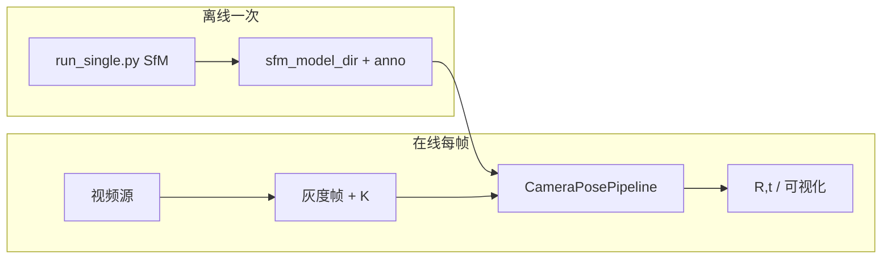

# 相机视频流 Pose Estimation 设计文档

本文档基于对 `run_single.py` 与 `test_onnx/onnx_demo/pipeline_single.py` 的代码审阅，说明如何将 OnePose 从**离线图像序列**扩展到**相机视频流**输入，并给出可实现的 API 设计与测试用例。

---

## 1. 现有代码职责划分

### 1.1 `run_single.py`（SfM 离线重建）

| 能力 | 说明 |
|------|------|
| 输入 | 数据集目录下的 `color/*.png` 列表，经 `down_ratio` 抽样 |
| 后端 | `onnx` / `torch_cpu` / `auto`：SuperPoint + SuperGlue 特征与匹配 |
| 输出 | COLMAP 三角化、`sfm_ws/model`、经 3D 包围盒过滤后的 `anno`（`anno_3d_*.npz` 等） |
| 与在线推理关系 | **不直接做逐帧位姿**；为 `pipeline_single.py` 提供必须先完成的**物体模型与标注** |

**结论**：视频流 pose estimation **依赖** `run_single.py`（或等价 `run.py` SfM 流程）事先产出的 `sfm_model_dir`，运行时不再重复跑 SfM。

### 1.2 `pipeline_single.py`（ONNX 推理流水线）

| 组件 | 作用 |
|------|------|
| `SuperPointOnnx` | 灰度图 → 2D 关键点与描述子 |
| `SuperGlueOnnx` | 参考帧与查询帧 2D–2D 匹配（检测器用） |
| `GATsSPGOnnx` | 2D–3D 匹配（主推理） |
| `LocalFeatureObjectDetectorOnnx` | 用 SfM 参考视图建立 DB，对当前帧做匹配 + RANSAC 仿射 → 裁剪 ROI |
| `OnnxOnePosePipeline.run_sequence` | 读 `color_full/*.png` 序列，逐帧：检测 → 裁剪 → 特征 → 3D 匹配 → `ransac_PnP` |

**与视频流的差距**：

- `run_sequence` 强依赖**磁盘路径**（`cv2.imread`、`img_path` 传入 `detector.detect` / `previous_pose_detect`）。
- `LocalFeatureObjectDetectorOnnx.crop_img_by_bbox` 内部对**整图**再次 `cv2.imread(query_img_path)`，视频流应改为**纯内存**的 `crop + resize`（与 `pose_estimation_node.py` 中写临时文件 workaround 思路一致，长期应 API 化）。

---

## 2. 设计目标

1. **输入**：连续帧（USB 摄像头、`cv2.VideoCapture`、RTSP、或 ROS `sensor_msgs/Image`）。
2. **输出**：每帧（或降采样后）的 `R, t`（或 `T_wc`）、内参修正后的 `K_crop`、可选可视化与耗时统计。
3. **复用**：逻辑上与 `OnnxOnePosePipeline.run_sequence` 的**单帧循环**一致；不重复 `run_single.py` 的 SfM。
4. **可选**：首帧全图检测，后续帧优先 `previous_pose_detect`（投影 3D 框）以降低延迟（与现有 `run_sequence` 一致）。

---

## 3. 总体架构



- **离线**：`run_single.py` 生成 `outputs_superpoint_superglue/` 下 `anno`、`sfm_ws/model` 等。
- **在线**：新模块（建议命名见下文）加载 ONNX + `npz` 标注 + 3D 框路径，对每帧调用统一入口 `process_frame`。

---

## 4. 数据结构与配置 API

### 4.1 `CameraPipelineConfig`（建议）

| 字段 | 类型 | 说明 |
|------|------|------|
| `superpoint_onnx` | `str` | SuperPoint ONNX 路径 |
| `superglue_onnx` | `str` | SuperGlue ONNX（检测器） |
| `gatsspg_onnx` | `str` | GATsSPG ONNX（2D–3D） |
| `sfm_model_dir` | `str` | 含 `outputs_superpoint_superglue/` 的根目录 |
| `data_root` | `str` | 物体数据根（用于 `get_3d_box_path` 等，与现流水线一致） |
| `num_leaf` | `int` | 默认 `8`，同 `OnnxOnePosePipeline` |
| `max_num_kp3d` | `int` | 默认 `2500` |
| `sp_config` | `dict \| None` | 传入 `SuperPointOnnx`，与 `pipeline_single` 对齐 |
| `crop_size` | `int` | 默认 `512` |
| `use_temp_file_for_detect` | `bool` | 兼容旧 `detect(query_img_path)`：若 `True` 则写临时 PNG（与现 ROS 节点一致）；目标实现应支持 `False` + 内存裁剪 |

### 4.2 `FrameInput`

| 字段 | 类型 | 说明 |
|------|------|------|
| `gray` | `np.ndarray` | `uint8`，形状 `(H, W)` 灰度 |
| `K` | `np.ndarray` | `float64/float32`，`3×3` 相机内参（全分辨率） |
| `timestamp` | `float \| None` | 可选，用于日志或 ROS `header.stamp` |
| `frame_id` | `int \| None` | 可选单调递增 id |

### 4.3 `PoseEstimationResult`

| 字段 | 类型 | 说明 |
|------|------|------|
| `pose_mat` | `np.ndarray` | `3×4` 或 `4×4` 位姿（与 `ransac_PnP` / 现有 `save_demo_image` 约定一致） |
| `pose_homo` | `np.ndarray` | `4×4` 齐次矩阵（若上游已有） |
| `inliers` | `np.ndarray` | PnP 内点索引或 mask |
| `num_inliers` | `int` | 内点数 |
| `K_crop` | `np.ndarray` | 裁剪后 `3×3` 内参 |
| `bbox` | `np.ndarray` | `[x0,y0,x1,y1]` 检测框（整图坐标） |
| `timing_ms` | `dict[str, float]` | 可选：`detect` / `extract` / `match3d` / `pnp` |
| `ok` | `bool` | 是否满足最小内点数等阈值 |

---

## 5. 核心类 API 设计

### 5.1 `CameraPosePipeline`

负责加载模型与 3D 标注缓存（对应 `OnnxOnePosePipeline.__init__` + `run_sequence` 中 `avg_data/clt_data/idxs` 加载）。

```python
class CameraPosePipeline:
    def __init__(self, config: CameraPipelineConfig) -> None: ...

    def reset(self) -> None:
        """清空上一帧位姿与帧序号，用于新序列或丢跟踪后重初始化。"""

    def process_frame(self, frame: FrameInput) -> PoseEstimationResult:
        """单帧推理；内部维护 frame_id 与上一帧 pose，用于 previous_pose_detect 分支。"""
```

**内部行为（与 `run_sequence` 对齐）**：

1. `frame_id == 0` 或 `上一帧 inliers < 8`：`LocalFeatureObjectDetectorOnnx.detect`（全图或内存路径）。
2. 否则：`previous_pose_detect`（需 `bbox3d`、`pre_pose`）。
3. `SuperPointOnnx` 对 crop 提取 `kpts2d, desc2d`。
4. `GATsSPGOnnx` 2D–3D 匹配。
5. `ransac_PnP(K_crop, mkpts2d, mkpts3d, ...)`。

**必须补充的私有方法（实现细节）**：

- `_detect_and_crop_in_memory(gray, K)`：替代依赖 `query_img_path` 的读写；逻辑复制 `crop_img_by_bbox` + `get_image_crop_resize` / `get_K_crop_resize`，输入为 `np.ndarray`。
- 若短期内保留临时文件：`_detect_and_crop_via_tmp(gray, K)` 调用现有 `detect(..., _TMP_IMG_PATH)`。

### 5.2 `VideoSource`（抽象，便于测试）

```python
class VideoSource(Protocol):
    def read(self) -> tuple[bool, np.ndarray | None]: ...
    def width(self) -> int: ...
    def height(self) -> int: ...
    @property
    def intrinsic_path(self) -> str | None: ...  # 可选，固定标定文件
```

实现类：

- `OpenCVCameraSource(device_id: int, width: int, height: int)`
- `VideoFileSource(path: str)`（离线视频回归测试）

### 5.3 `run_camera_loop`（可选 CLI / 脚本入口）

```python
def run_camera_loop(
    pipeline: CameraPosePipeline,
    source: VideoSource,
    K: np.ndarray,
    *,
    max_frames: int | None = None,
    display: bool = False,
    vis_dir: str | None = None,
) -> list[PoseEstimationResult]:
    """从 VideoSource 连续 read，直到 EOF 或 max_frames。"""
```

---

## 6. 与 `run_single.py` / `pipeline_single.py` 的差异小结

| 项目 | `run_single` | `pipeline_single.run_sequence` | 本设计 `CameraPosePipeline` |
|------|----------------|--------------------------------|-----------------------------|
| 输入 | 数据集 png 列表 | `color_full/*.png` | `FrameInput.gray` + `K` |
| SfM | 执行 | 不执行（读现成 model） | 不执行 |
| 输出 | 模型与 anno | 每帧 pose + mp4 | 每帧 `PoseEstimationResult` |
| 路径依赖 | 图像路径 | 强依赖 | **消除对帧文件路径的硬依赖**（推荐） |

---

## 7. 与现有 ROS2 节点关系

`onepose_ros_demo/pose_estimation_node.py` 已实现 `camera_topic` 模式：订阅图像、拼 `K`、调用与 `pipeline_single` 等价的步骤，并用临时 PNG 适配检测器。

**建议**：

- 将**单帧逻辑**抽到共享模块 `CameraPosePipeline.process_frame`，ROS 节点仅负责 `Image` → `FrameInput`、结果 → `PoseStamped`。
- 减少 `/tmp` 临时文件：在 `LocalFeatureObjectDetectorOnnx` 增加 `detect_from_array(...)` 或在 `camera_pipeline` 层实现内存裁剪（见第 5 节）。

---

## 8. 测试用例

### 8.1 单元测试

| ID | 名称 | 前置条件 | 步骤 | 期望 |
|----|------|----------|------|------|
| UT-01 | `SuperPointOnnx` 形状 | 有效 ONNX | 输入 `(1,1,H,W)` float32 | `keypoints` 为 `(N,2)`，`descriptors` 为 `(256,N)` |
| UT-02 | `FrameInput` 校验 | — | `gray` 为 `(H,W)` uint8，`K` 为 3×3 | 构造成功；错误 dtype/shape 时抛清晰异常（若实现校验） |
| UT-03 | 内存裁剪一致性 | 同一张图 | 对同 `bbox,K` 比较 `crop_img_by_bbox(path)` 与 `_detect_and_crop_in_memory` | 像素最大差 ≤ 1（允许舍入） |
| UT-04 | `reset` | pipeline 已跑多帧 | 调用 `reset()` 再 `process_frame` | 行为等价于首帧（走全图 detect 分支） |

### 8.2 集成测试（需 demo 数据与 ONNX）

| ID | 名称 | 前置条件 | 步骤 | 期望 |
|----|------|----------|------|------|
| IT-01 | 与 `run_sequence` 首帧一致 | `test_coffee` + sfm_model + onnx | 用 `color_full/0.png` 构造 `FrameInput`，`K` 来自 `intrinsics.txt` | `pose` 与 `run_sequence` 首帧误差在数值容差内（例如旋转 Frobenius、平移相对误差） |
| IT-02 | 短视频文件 | 同 IT-01 | `VideoFileSource(demo.mp4)` + `run_camera_loop(..., max_frames=30)` | 30 帧均有 `ok` 或统计 `ok` 比例；无未捕获异常 |
| IT-03 | 降采样帧率 | — | 每 N 帧处理一次 | `timing` 平均延迟下降；结果仍可接受（业务阈值自定） |

### 8.3 回归 / 性能

| ID | 名称 | 指标 |
|----|------|------|
| PF-01 | 单帧延迟 | 在目标硬件上报告 `detect/extract/match3d/pnp` ms，与 `run_sequence` 打印量级可比 |
| PF-02 | 长时间运行 | 连续 ≥ 30 min 无内存持续增长（可选 `tracemalloc`） |

### 8.4 异常与边界

| ID | 场景 | 期望 |
|----|------|------|
| EX-01 | 摄像头断开 | `read()` 失败时返回明确错误 or `ok=False`，不崩溃 |
| EX-02 | 全黑帧 | 匹配点不足；`ok=False`，不 segfault |
| EX-03 | `K` 与分辨率不匹配 | 文档约定：调用方负责将 `K` 与 `gray` 分辨率对齐；可选断言 |

---

## 9. 实现顺序建议

1. 从 `OnnxOnePosePipeline.run_sequence` 抽出 **`_process_single_frame`** 逻辑，输入改为 `FrameInput`，输出 `PoseEstimationResult`。
2. 实现 **`_detect_and_crop_in_memory`**（或临时文件版先打通）。
3. 添加 **`CameraPosePipeline`** + **`run_camera_loop`** + **单元/集成测试**。
4. 可选：合并 **ROS 节点** 与共享模块，删除重复代码。

---

## 10. 参考文件路径

| 文件 | 用途 |
|------|------|
| `run_single.py` | 离线 SfM + anno，视频流前置依赖 |
| `test_onnx/onnx_demo/pipeline_single.py` | ONNX 检测、2D–3D 匹配、PnP 参考实现 |
| `onepose_ros_demo/onepose_ros_demo/pose_estimation_node.py` | 相机话题、临时图、与流水线对接的现有工程化示例 |

---

*文档版本：与仓库审阅时 `run_single.py`、`pipeline_single.py` 行为一致；实现时以实际代码为准。*

## 11.任务目标

使用视频流模拟相机输入：
视频路径：/home/data/qrb_ros_simulation_ws/OnePose-main/data/demo/test_coffee/test_coffee-test/Frames.m4v
模型文件：/home/data/qrb_ros_simulation_ws/OnePose-main/data/models/onnx

a. 根据你的设计文档，实现上述视频流在线推理的Pipeline，保存为pipeline_online.py

b. 先使用保存临时文件的方法打通pipeline

c. 调试并运行pipeline_online.py，根据你的测试用例给出测试报告

你可以使用source ~/miniconda3/bin/activate && conda activate onepose激活虚拟环境