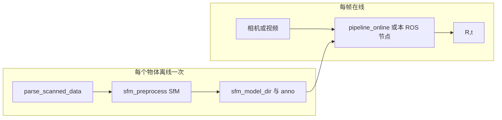

# onepose_ros_demo

ROS 2（Jazzy）节点，封装 **OnePose ONNX 推理管线**，在 `/pose_estimation_result` 与自定义消息话题上发布 6-DoF 位姿。

---

## OnePose 完整管线（从扫描到相机推位姿）

相机/视频在线位姿估计依赖**事先在同一物体上**完成的离线 SfM 与标注；运行时**不会**重复跑 COLMAP。更细的 API 与参数见 `onepose_ros_demo/onnx_demo/camera_pipeline.md`。

### 依赖关系（简图）



### 阶段说明

| 顺序 | 脚本 / 入口 | 阶段 | 产出 / 作用 |
|------|----------------|------|----------------|
| ① | `onnx_demo/parse_scanned_data.py` | 数据准备 | 从 ARKit 等扫描目录解析视频与位姿，生成 `intrinsics.txt`、`box3d_corners.txt`、`color/`、`color_full/`、`poses/` 等，供后续 SfM 与测试序列使用 |
| ② | `onepose_ros_demo/onnx_demo/sfm_preprocess.py` | 离线 SfM（一次） | COLMAP 三角化 + 后处理，生成 `sfm_model/outputs_superpoint_superglue/{anno,sfm_ws/model}`；**推荐 `--backend onnx`**，与在线推理一致 |
| ③ | `onnx_demo/pipeline_single.py` | 离线逐帧验证（可选） | 读 `color_full/*.png`，跑与线上一致的检测 + 2D–3D + PnP，用于确认 ② 的产物 |
| ④ | `onnx_demo/pipeline_online.py` 或 **本包 ROS 节点** | 在线相机 / 视频 | 每帧：灰度 + 内参 K →（当前实现经临时 PNG）检测 → 裁剪 → SuperPoint → GAT 2D–3D → PnP → 位姿 |

**约束**：`data_root`、`seq_dir`、`sfm_model_dir` 必须对应**同一物体**；用 A 物体的 SfM 去匹配 B 物体的图像会导致错误检测。

### 上线前检查清单

| 步骤 | 内容 |
|------|------|
| 数据 | 扫描目录经 `parse_scanned_data` 得到标准布局；或已有等价的 `data_root` + `seq_dir` |
| SfM | `sfm_preprocess.py --backend onnx` 生成 `outputs_superpoint_superglue/` |
| 模型 | 三个 ONNX：`superpoint.onnx`、`superglue.onnx`、`gatsspg.onnx`（路径与 launch / YAML 一致） |
| 配置 | `pipeline_online.yml` 或 launch 参数：路径、内参、`tmp_*`、检测阈值等与 `camera_pipeline.md` 一致 |
| 运行 | 命令行：`python -m onnx_demo` 相关入口或 `pipeline_online.py`；ROS：`ros2 launch onepose_ros_demo camera_topic.launch.py` |

---

## Package layout

```
onepose_ros_demo/
├── CMakeLists.txt
├── package.xml
├── data/                          ← 标注与 SfM 数据（可选；存在时安装到 share/<pkg>/data/）
│   └── demo/                      ← 演示物体根目录，如 mark_cup、test_coffee
├── msg/
│   └── PoseEstimationResult.msg   ← custom ROS2 message
├── onepose_ros_demo/
│   ├── __init__.py
│   ├── pose_estimation_node.py    ← main ROS2 node
│   └── onnx_demo/                 ← bundled ONNX pipeline (+ sfm_preprocess.py)
├── launch/
│   ├── local_file.launch.py       ← play back local image sequence
│   └── camera_topic.launch.py     ← subscribe to camera topics
└── config/
    └── params.yaml                ← default parameters
```

---

## Prerequisites

### 1. Conda environment（示例）

```bash
source ~/miniconda3/etc/profile.d/conda.sh   # 或 source ~/miniconda3/bin/activate
conda activate onepose
```

### 2. ONNX models

需要三个 ONNX 文件；构建安装后默认位于：

```text
install/onepose_ros_demo/lib/onepose_ros_demo/onnx_demo/models/onnx/
    superpoint.onnx
    superglue.onnx
    gatsspg.onnx
```

源码树中对应路径为 `onepose_ros_demo/onnx_demo/models/onnx/`。若需自行导出，请按你上游 OnePose / ONNX 仓库的说明导出并放到上述目录。

### 3. ROS 2 Jazzy

```bash
source /opt/ros/jazzy/setup.bash
```

---

## Build

```bash
cd /path/to/your/ros2_ws   # 包含本包的 workspace
colcon build --packages-select onepose_ros_demo --symlink-install
source install/setup.bash
```

若源码中存在 `data/` 目录，构建时会将其安装到 `install/onepose_ros_demo/share/onepose_ros_demo/data/`，launch 通过 `get_package_share_directory` 解析默认数据路径。

---

## 运行步骤（推荐顺序）

### 一键脚本（SfM + Build + Launch）

已提供一键可复现脚本：`scripts/run_onepose_local_demo.sh`，默认对象为 `test_coffee`，按顺序执行：

1. `sfm_preprocess.py --backend onnx`
2. `colcon build --packages-select onepose_ros_demo --symlink-install`
3. `ros2 launch onepose_ros_demo local_file.launch.py`

```bash
cd /path/to/onepose_ros_demo
bash scripts/run_onepose_local_demo.sh
```

常见可选参数：

```bash
# 指定对象名（对应 data/demo/<object>）
bash scripts/run_onepose_local_demo.sh --object test_coffee

# 跳过 SfM（已生成 sfm_model 时）
bash scripts/run_onepose_local_demo.sh --skip-sfm

# 跳过构建（仅重启 launch）
bash scripts/run_onepose_local_demo.sh --skip-build

# 透传 launch 参数（可重复）
bash scripts/run_onepose_local_demo.sh --launch-arg publish_rate_hz:=5.0
```

### 1. 准备标注数据集

将已完成解析 / 标注的物体数据放到**本包根目录**（与 `CMakeLists.txt` 同级）下的 `data/demo/` 中，例如：

- `data/demo/<物体名>/`：含 `box3d_corners.txt`、训练 / 建图序列子目录（如 `<物体名>-annotate`，内含 `color/`、`poses_ba/`、`intrin_ba/` 等，与 OnePose 数据布局一致）。
- 测试相机序列可放在同级另一子目录（如 `test_coffee-test`），由 launch 参数 `seq_dir` 指向。

若数据来自 ARKit 等扫描目录，可先用 `onepose_ros_demo/onnx_demo/parse_scanned_data.py` 生成上述布局，再拷贝到 `data/demo/`。

### 2. 运行 SfM 预处理生成 `sfm_model`

在**已激活** Conda / 依赖环境的前提下，于包根目录执行（将 `<物体名>` 换成实际目录名，如 `mark_cup`；第二个词为带 `color/` 的 annotate 序列目录名）：

```bash
cd /path/to/onepose_ros_demo          # 含 CMakeLists.txt 的包根目录
conda activate onepose                # 若使用 conda，见上文 Prerequisites

python onepose_ros_demo/onnx_demo/sfm_preprocess.py \
  --data-dir "$(pwd)/data/demo/<物体名> <物体名>-annotate" \
  --outputs-dir "$(pwd)/data/demo/<物体名>/sfm_model" \
  --backend onnx
```

- `--work-dir` 默认为 `onnx_demo/` 所在目录，用于解析相对路径与默认 ONNX；也可显式传入 `--work-dir /path/to/onepose_ros_demo/onepose_ros_demo/onnx_demo`。
- 需已具备 `superpoint.onnx` / `superglue.onnx`（见下文 **ONNX models**），或改用 `--backend torch_cpu` 并配置对应 `.pth`。
- 成功后应在 `data/demo/<物体名>/sfm_model/` 下得到 `outputs_superpoint_superglue/` 等产物，供节点 `sfm_model_dir` 使用。

### 3. `colcon build` 并运行位姿节点

```bash
cd /path/to/your/ros2_ws
source /opt/ros/jazzy/setup.bash
colcon build --packages-select onepose_ros_demo --symlink-install
source install/setup.bash
```

安装后的节点脚本路径为：

`install/onepose_ros_demo/lib/onepose_ros_demo/pose_estimation_node.py`

推荐使用 ROS 2 入口启动（已加载消息与工作空间环境变量）：

```bash
ros2 run onepose_ros_demo pose_estimation_node.py --ros-args \
  -p input_mode:=local_file \
  -p data_root:=... -p seq_dir:=... -p sfm_model_dir:=...
```

在已 `source install/setup.bash` 的前提下，也可直接调用安装树中的同一脚本（需自行补齐 `--ros-args` 与参数；一般更推荐 **launch**）：

```bash
python install/onepose_ros_demo/lib/onepose_ros_demo/pose_estimation_node.py --ros-args ...
```

日常更简便的方式是使用下方 **launch**（参数默认值已指向 `share/.../data/` 或源码 `data/`）。

---

## Run（launch 启动）

### Mode 1 – Local file（从磁盘图像序列回放）

默认数据根为 **`get_package_share_directory('onepose_ros_demo')/data/demo/mark_cup`**（安装后），或源码树 **`data/demo/mark_cup`**；可用参数覆盖 `data_root`、`seq_dir`、`sfm_model_dir`。

```bash
ros2 launch onepose_ros_demo local_file.launch.py
```

可选参数示例：

```bash
ros2 launch onepose_ros_demo local_file.launch.py \
    publish_rate_hz:=5.0 \
    loop_sequence:=true
```

device 端推荐使用**绝对路径**覆盖数据参数（避免安装目录变化导致默认相对路径不一致）：

```bash
source /opt/ros/jazzy/setup.bash
source /path/to/your_ws/install/setup.bash

ros2 launch onepose_ros_demo local_file.launch.py \
    data_root:=/tmp/onepose_data/demo/test_coffee \
    seq_dir:=/tmp/onepose_data/demo/test_coffee/test_coffee-test \
    sfm_model_dir:=/tmp/onepose_data/demo/test_coffee/sfm_model
```

### Mode 2 – Camera topic（实时相机）

```bash
ros2 launch onepose_ros_demo camera_topic.launch.py \
    image_topic:=/camera/image_raw \
    camera_info_topic:=/camera/camera_info
```

需为**同一物体**配置好 `data_root`、`seq_dir`、`sfm_model_dir` 与三个 ONNX 路径（见 launch 默认值或自行覆盖；默认示例物体为 `data/demo/test_coffee`）。

---

## Inspect results

在已 `source` 工作空间的终端中：

```bash
ros2 topic echo /pose_estimation_result

ros2 topic hz /pose_estimation_result

ros2 interface show onepose_ros_demo/msg/PoseEstimationResult
```

---

## Custom message: `PoseEstimationResult`

| Field              | Type          | Description                                      |
|--------------------|---------------|--------------------------------------------------|
| `header`           | std_msgs/Header | Timestamp + frame_id                           |
| `input_source`     | string        | `"local_file"` or `"camera_topic"`               |
| `frame_id`         | int32         | 0-based frame counter                            |
| `rotation_matrix`  | float64[9]    | 3×3 rotation matrix, row-major                   |
| `translation_vector` | float64[3]  | Translation vector (metres)                      |
| `pose_matrix_4x4`  | float64[16]   | Full 4×4 homogeneous pose, row-major             |
| `num_inliers`      | int32         | PnP RANSAC inlier count (-1 on failure)          |
| `success`          | bool          | `true` when pose estimation succeeded            |

---

## 相关文档

- `onepose_ros_demo/onnx_demo/camera_pipeline.md`：在线管线设计、`CameraPipelineConfig`、`pipeline_online.yml` 字段说明
- `onepose_ros_demo/onnx_demo/pipeline_online.yml`：在线推理默认配置示例
